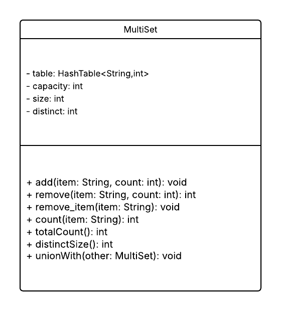

**Introduction**

The Multiset I am going to design is a player inventory that stores the string item names and their count value (if the all the item appears multiple times their count will increase by 1 every time and I will be implementing this using the HashTable. Each unique will be the key and the value will count the number of times that key appears. This structure would be fast for inserting, removing and even for looking up the items.

Example: "potion": 3

potion is the key and 3 is the value/count i.e. the number of potions he has in the inventory. Adding 1 more potions will increase the value to 4 and so on.

**Design Philosophy**

Efficiency: The operations such as adding or removing items will occur in O (1) time complexity because of the hash table structure. Count would also be O (1) as we can maintain a count variable that add 1 every time, we add item or decrease by 1 id remove item.

Simplicity: This focuses on the game-relevant operations (add, remove, count, contains).

Extensibility: The design allows adding future operations like random removal.

Readability: Clear method semantics, consistent handling of edge cases and well-defined invariants ensure that developers or other game-system modules can safely interact with the Multiset.

Clients and Users:

Client: Game module such as inventory management of games.

User: Players those are playing the game and interact with inventories through the game mechanics.

**Core Operations**

**Add (item, count)**

Concept: Adds count copies of item to the player inventory.

Average Time Complexity: O (1)

Edge Cases: Adding items more than available space will handle the error (e.g., returning “bag is full”).

HashTable support: Key lookup, insertion or remove using pseudo-random probing that          ensures fast access.

**Remove (item, count)**

Concept: Removes the count by 1 every time if remove occurs and if reaches 0 removes the Key.

Average Time Complexity: O (1)

Edge Cases: Removing the non-existent item returns 0 and removal of more than present items in the Multiset counts to 0.

HashTable Support: Efficient lookup and update, with slot marked empty upon deletion.

**Count(item)**

Concept: Returns the count of individual items in the inventory.

Average Time Complexity: O (1)

Edge Cases: False for missing keys/item.

**totalCount()**

Concept: Returns the total number of items in the inventory by summing up all the counts of every item.

Time Complexity: O (1)

Edge Case: At the starting totalCount would be 0.

**distinctSize()**

Concept: Counts up all the unique items in the inventory.

Time Complexity: O (1)

Edge Case: At the starting totalCount would be 0.

**Set Operations**

**UnionWith (Other)**

Game Analogy: This combines the two players inventories or merge loot drops.

Operation: For each Key in other, increment the count in current Multiset by other's count.

Conceptual Complexity: O(other.distinctSize)

Edge Cases: pseudo-random handles the collisions during insertion and adding items more than available space will handle the error by returning "bag is full".

**Extension Feature**

**Remove_item(item)**

Purpose: Removes a specified item from the inventory completely, setting its count to 0 and deleting its key from the table.

New Methods: Public method remove\_item(item).

Looks up the item in the hash table Sets its count to 0 and deletes the key.

Time Complexity: O(1)

Gameplay Value: Supports game mechanics where an enemy can steal a specific item from the player. By removing the item completely from the inventory.

pseudocode block for remove\_item(item)

  function remove\_item(item){

    if(table.contains(item){

      table(item.count) = 0;

      delete table(item);

    })
  }

**UML DIAGRAM**

**Trade-off Analysis**

| Data Structure | Advantages | Disadvantages | Core functions |
| --- | --- | --- | --- |
| HashTable | Fast average-case O(1) for add/remove/lookup | No ordering | Insert avg O(1), remove O(1), lookup O(1) |
| AVLTree | Sorted order | More complex rotations | Lookup O(log n), Insert O(log n), Remove O(log n) |

**Why not AVLTree?**

AVLTree guarantees sorted traversal and predictable O(log n) operations but it adds complexity (rotations, balance factors) and higher memory overhead. For a player inventory, fast average-case operations are more important than sorted order, so HashTable is the better fit.

**Alternative Design Sketch**

If I had chosen AVL Tree instead of a hashtable, then I would have ordered multiset but many functions would run in O(log n) instead of O(1), because AVL Tree performs rotations to stay balanced. The design would be complex I need to implement left and right rotations.

In this design, the multiset would still support add, remove, count and union use tree navigation instead of simple hashing. This version would be better for applications where item order matters, but less ideal for fast, constant-time inventory operations like in most games.

**Evaluation Plan**

To test my Multiset design, I would run several categories of tests to make sure all functions works properly.

Add Test: Add new items, add existing items, add large counts, and check if counts update correctly.

Remove Test: Remove items that exist, remove more than the current count, remove from an empty inventory.

Remove_item test: Make sure the item is fully deleted and its count becomes 0.

Count Test: Check correct counts for existing and non-existing items.

Union Tests: Combine two multisets and verify that all counts add up correctly.

**To check whether the design is easy to extend in the future:**

**Code Readability:** Methods should be short and have clear names and have all comments explaining all methods properly.

**Easy To Add New Features:** Must be easy to add new features for the further updates.